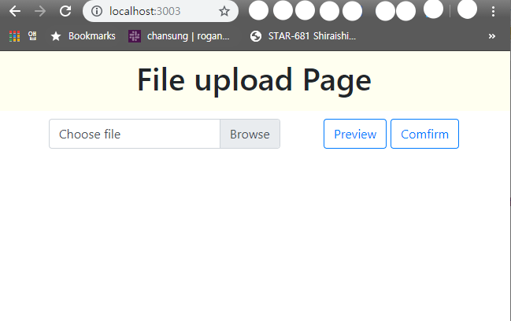
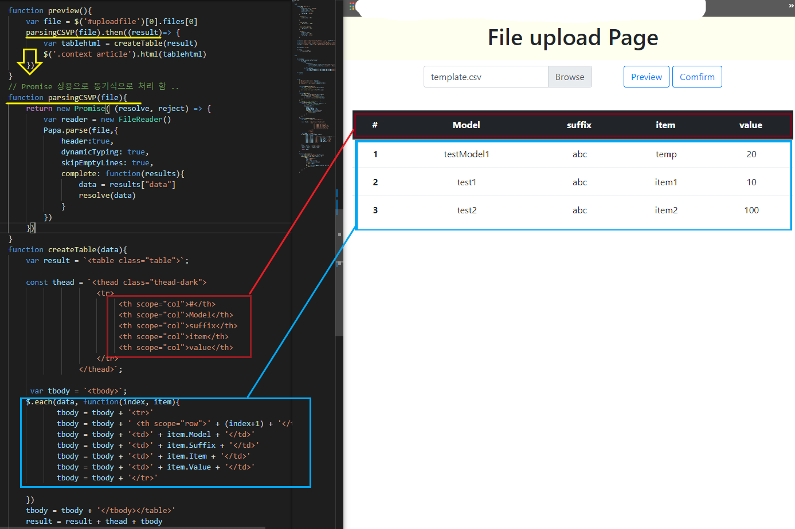
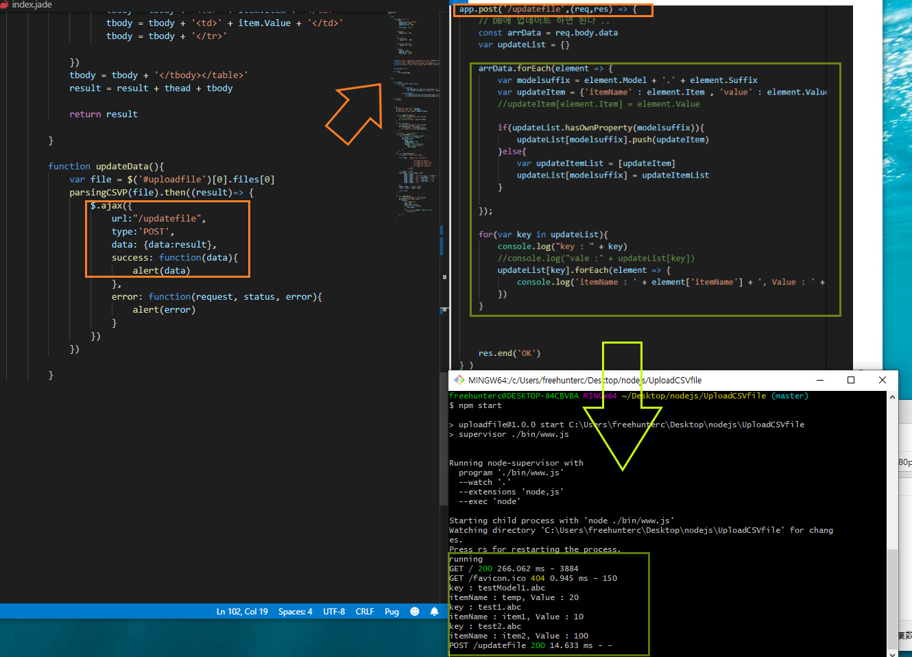

웹브라우져로 업로드 한 CSV 파일을 parse하여 테이블로 보여주고 서버에 넘기는 예제 소스 입니다.

> 시작하는 방법: cmd 창에서 "npm start" 를 입력시면 됩니다.  
To get started: input "npm start" in the cmd.

> 테스트를 위해서  template.csv라는 파일을 첨부하였습니다.  
Attached for test is a file named  template.csv.

해당 주소로 들어가면 아래와 같은 화면이 보입니다.

csv파일을 업로드하고 preview 버튼을 누르면 다음과 같이 테이블로 보입니다.

comfirm버튼을 누르면 데이터가 서버측으로 전송 됩니다.

